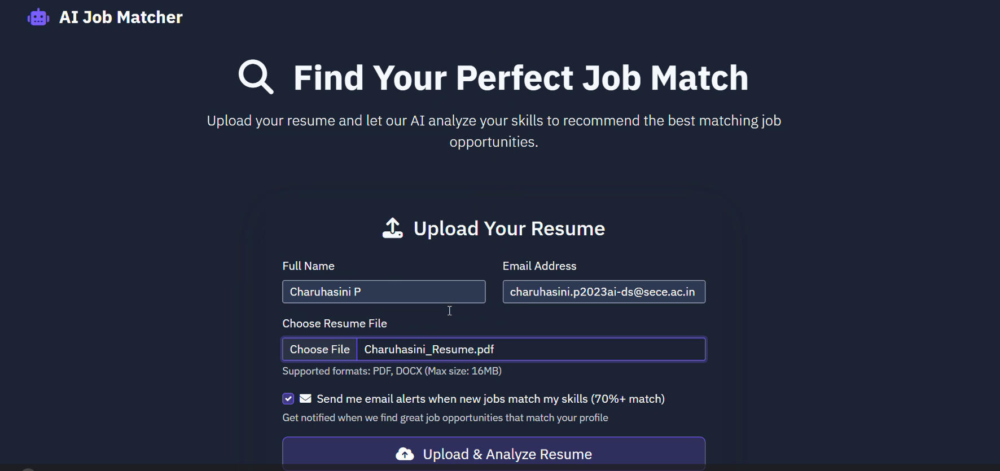
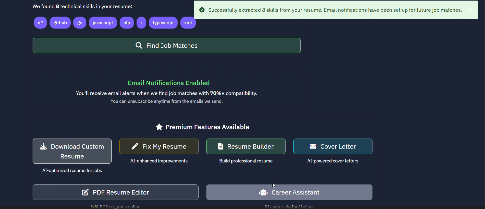
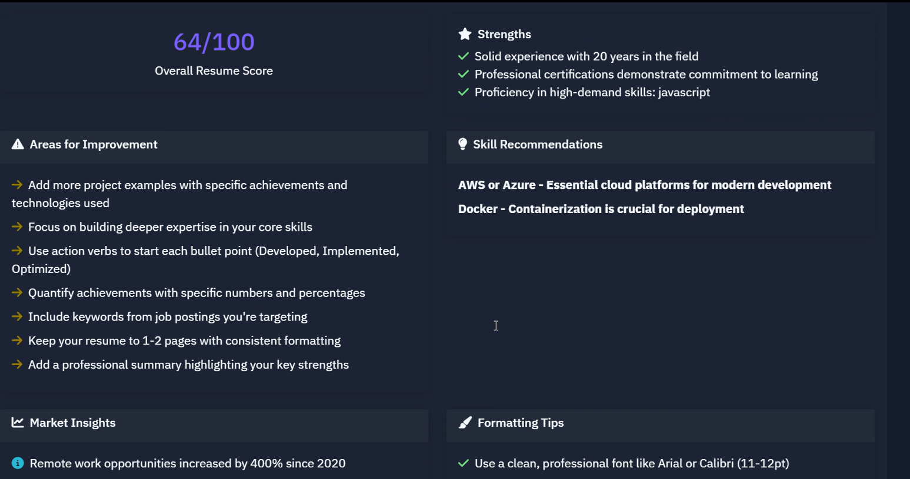
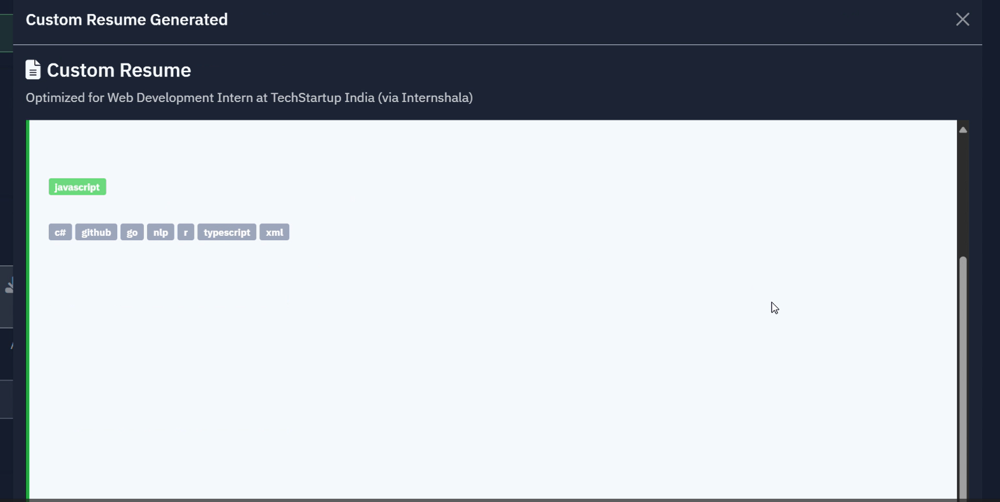
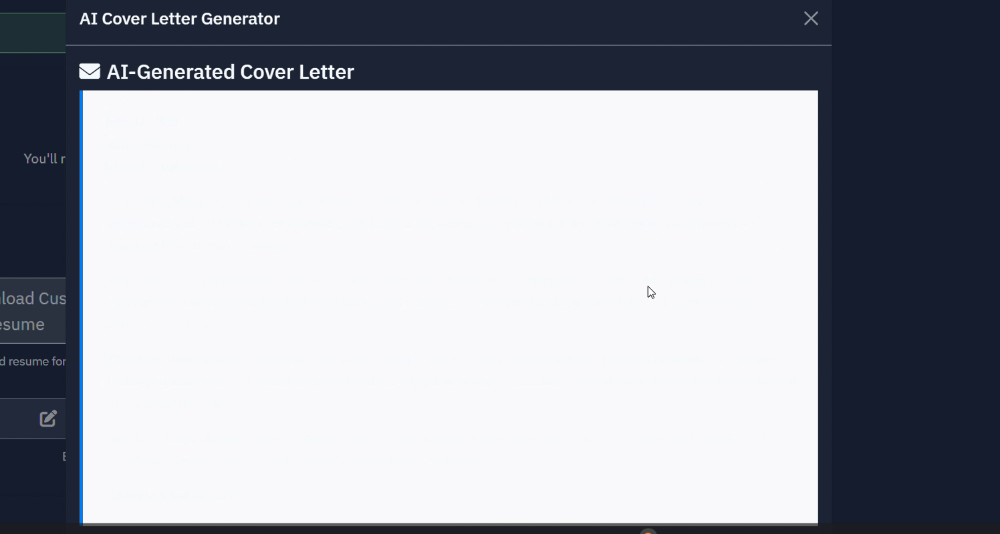
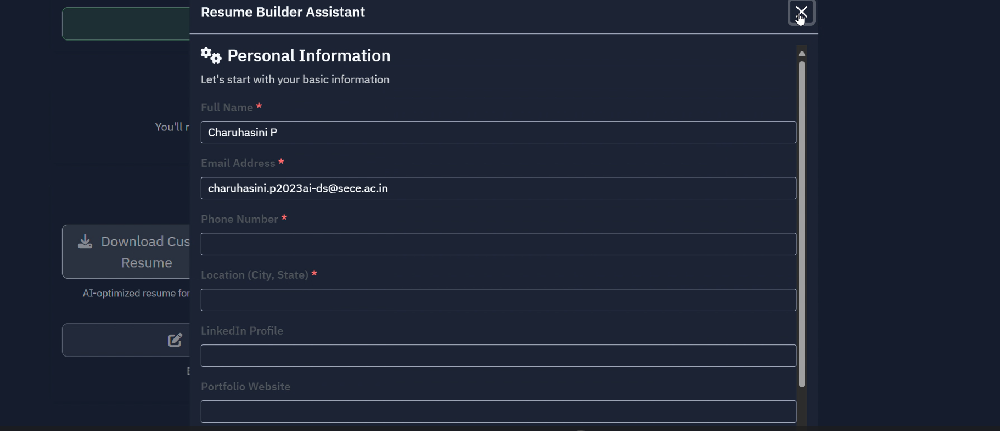

# 🚀 AI Job/Internship Matcher


---

## 🧠 Overview

AI Job/Internship Matcher is a full-stack AI-powered web application that analyzes resumes, extracts skills, and matches candidates with the most suitable job opportunities using intelligent scoring and machine learning techniques.

It simulates real-world ATS (Applicant Tracking System) systems used in companies to screen candidates.

---

## ✨ Features

### 📄 Resume Upload
- Upload PDF/DOCX resumes
- Supports files up to 16MB
- Extracts structured text from resumes

### 🤖 AI Skill Extraction
- Automatically detects technical skills
- Extracts programming languages, frameworks, tools
- Works on multiple resume formats

### 🎯 Smart Job Matching
- TF-IDF + Cosine similarity matching
- Keyword + semantic-based ranking
- Returns Top 5 job recommendations

### 📊 ATS Score System
- Simulates Applicant Tracking System scoring (0–100)
- Evaluates resume-job compatibility
- Provides recruiter-style feedback

### 🔍 Skill Gap Analysis
- Shows missing skills for each job
- Helps improve career roadmap
- Suggests skill improvements

### 💾 Data Storage
- Stores resumes and history
- Tracks user applications
- Persistent database integration

---

## 🏗️ System Architecture

Resume Upload → Text Extraction → Skill Extraction → Job Dataset  
→ AI Matching Engine (TF-IDF + Cosine Similarity)  
→ ATS Scoring System → Top 5 Job Recommendations

---

## 🛠️ Tech Stack

### Backend
- Python 3.11
- Flask
- SQLAlchemy
- PyPDF2
- python-docx
- scikit-learn

### AI / ML
- TF-IDF Vectorization
- Cosine Similarity
- Sentence Transformers (optional)

### Frontend
- HTML5
- CSS3
- JavaScript
- Bootstrap 5

---

## 📁 Project Structure


AI-Job-Intelligence-System/
│
├── app.py
├── main.py
├── models.py
├── job_matcher.py
├── skill_extractor.py
├── dummy_jobs.py
├── email_service.py
│
├── templates/
├── static/
├── uploads/
├── screenshots/
├── video/
└── README.md


---

## 📸 Screenshots

### 📄 Resume Upload


### 💎 Premium Features Page


### 📊 Resume Score Analysis


### 🧠 Custom Resume Builder


### 📄 Cover Letter Generator


### 🛠 Resume Builder Tool


---

## 🎥 Demo

👉 Watch Demo Video:

https://github.com/charuhasini308/AI-Job-Intelligence-System/Demo.mp4

OR

👉 YouTube Link:
https://youtu.be/x4fWP4QHBEA

---

## ⚙️ Installation

```bash
git clone https://github.com/your-username/AI-Job-Intelligence-System.git
cd AI-Job-Intelligence-System
Install dependencies
pip install -r requirements.txt
Run project
python app.py

🌐 API Endpoints
Method	Endpoint	Description
POST	/upload_resume	Upload resume
GET	/recommend	Get job matches
GET	/jobs	List all jobs
GET	/history	User history

📊 How It Works
User uploads resume
System extracts text
Skills are detected using NLP
Job dataset is compared
Similarity score is calculated
Top 5 jobs are shown

💡 Real-World Use Cases
Internship seekers
Freshers job applications
Resume improvement tools
Career guidance systems
Skill gap analysis platforms

🚀 Future Enhancements
Real-time job API integration (LinkedIn, Naukri)
GPT-based resume scoring
Mobile app version
Advanced analytics dashboard
AI career advisor chatbot

👨‍💻 Author
Charuhasini
AI & Data Science Student
Passionate about AI, ML, and Full Stack Development

📜 License
MIT License

⭐ Support

If you like this project, give it a ⭐ on GitHub.
